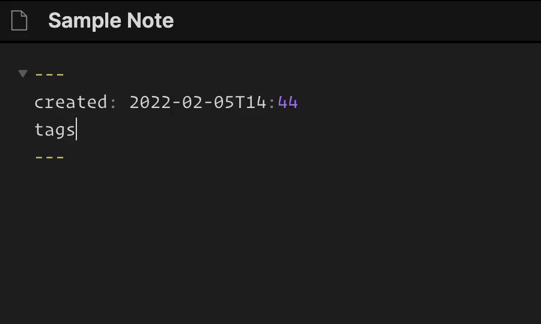

<div id="top"></div>
# Obsidian Front Matter Tag Wizard

Tired of having to type `#` to get tag autocompletion in your [Obsidian](https://obsidian.md/) note front matter? I feel your pain. This plugin enables tag autocompletion in your front matter...and beautifully formats those same tags to boot!



## Features

- Enables unprefixed Tag autocompletion in front matter!
- Fully supports multiline tags!
- Optional auto-formatting for tags (default: `enabled`)!

<p align="right">(<a href="#top">back to top</a>)</p>

## Getting Started

This plugin has not yet been submitted to Obsidian for review, but in the meantime it can be installed for testing via the [BRAT](https://github.com/TfTHacker/obsidian42-brat) plugin. 

1. Install [BRAT](https://github.com/TfTHacker/obsidian42-brat)
2. Go to the `Obsidian42 - BRAT` options tab
3. Click `Add Beta plugin` and enter the folling URL:
```
https://github.com/Tohsig/obsidian-front-matter-tag-wizard
```
4. Open the `Community Plugins` tab
5. Search for `Front Matter Tag Wizard` and enable the plugin.

Done! You should immediately get tag autocompletion and autoformatting in the front matter of your notes.

<p align="right">(<a href="#top">back to top</a>)</p>

## Auto-formatting
The built in auto-formatting is enabled by default and **only affects front matter tags**. No need to worry about the rest of your content. It will trigger automatically whenever you select an autocomplete suggestion (via `enter` or `mouseclick`), or when your cursor leaves the `tags:` list in your front matter.

When it runs, the auto-formatter will remove duplicate tags and then standardize tag formatting according to these options:

| Option                    | Description                                                      | Default       | 
| ------------------------- | ---------------------------------------------------------------- | ------------- |
| `Enable Auto-formatting`  | Enable/Disable auto-formatting completely                        | `enabled`     |
| `Auto-format Mode`        | Controls whether tags are put on a single line or multiple lines | `Single Line` |
| `Remove Extra Characters` | Removes `#` and `"` characters from your front matter tags       | `enabled`     |

<p align="right">(<a href="#top">back to top</a>)</p>

## Roadmap

- [ ] Add an option to sort front matter tags alphabetically.
- [ ] Allow autoformatter to edit background notes.
- [ ] Get some saner YAML parsing in here.
- [ ] Add "Format front matter tags" to quick switcher.

<p align="right">(<a href="#top">back to top</a>)</p>

## Contributing

Feel free to submit issues for bug reports and additional features! This is a project I spun up to support my daily workflow, so I'll be very interested to hear how it does elsewhre.

<p align="right">(<a href="#top">back to top</a>)</p>

## License

Distributed under the MIT License. See `LICENSE.txt` for more information.

<p align="right">(<a href="#top">back to top</a>)</p>

## Acknowledgments

Huge thanks to the incredible [Obsidian Dataview](https://github.com/blacksmithgu/obsidian-dataview) and [Obsidian Plugin Developer Docs](https://marcus.se.net/obsidian-plugin-docs/) projects. I was able to learn a ton about Obsidian's API from both, and I highly recommend them if you want to develop a plugin.

<p align="right">(<a href="#top">back to top</a>)</p>
